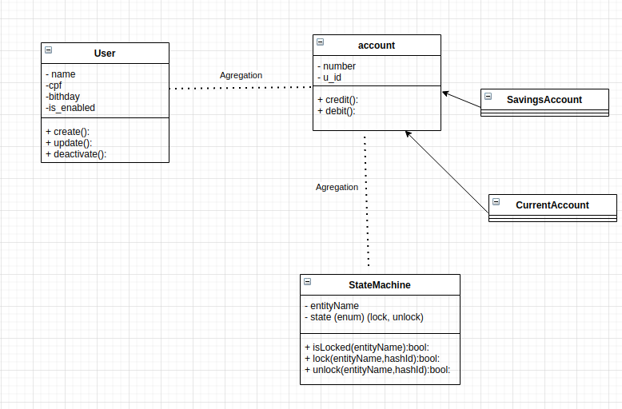

TODO improve this requirements 
- here will be an overview about the full project including links to others readme
- need to be simple, understandable & useful

#### requirements to this project [here](epic.md)

i will start with this idea, but this doesn't need to be a requirement only a quick introducing

### running the project
- First you need start the mysql & node container running the following command at project folder
`docker-compose up --build`

- then create the database that will be used on this project
`docker exec -i mysql  mysql -uroot -pserver -e 'create database atm_example'`

- after it you need to run the migrations to create the entities on database 
    - run it inside the mysql folder `src/infra/mysql`
        `npx sequelize db:migrate`